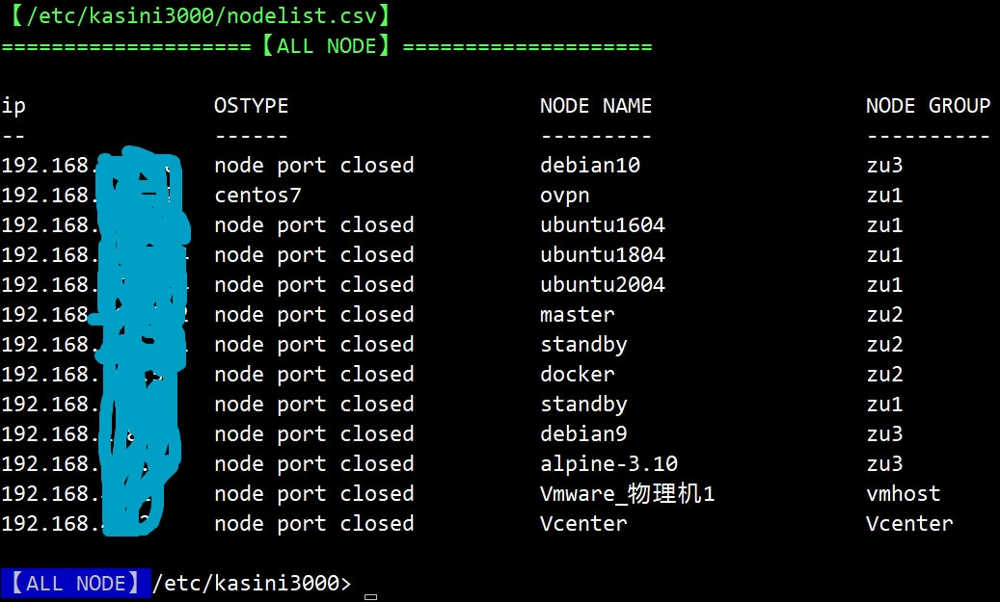
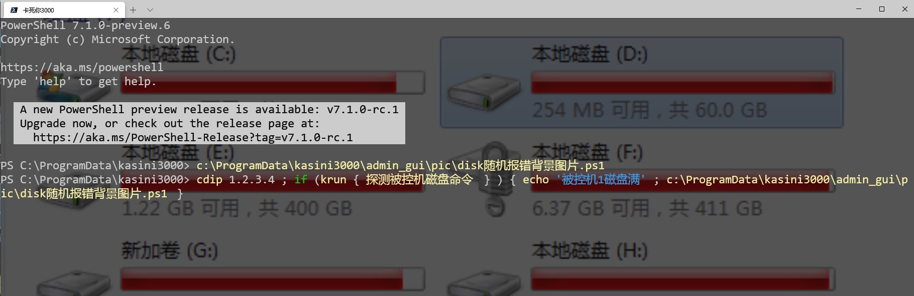

# kasini3000

This is an open source, free, cross-platform, batch, automation, operation and maintenance tool.

Similar to Puppet, SaltStack, Ansible, pipeline. Specifically developed for the shortcomings of ansible.

Cross-platform means that the master computer can be win or linux.

The master connected to the linux node uses the ssh protocol. The master connected to the win node uses the winrm protocol.

Master Control node based on [open source + free + cross-platform] powershell language.

The master computer uses the "push" script, push script blocks, and push and pull files to node.

Bash can be invoked through powershell,

100% compatible with .bash scripts on linux;

100% compatible with .csh scripts;

100% compatible with .zsh scripts, .py, .perl, etc.

100% compatible with .bat scripts on win; vbs scripts, py, etc.

Any old linux script can be executed from the master to the node by [the source code is embedded in the ps1 script file of the master], or the file is distributed.


----

Project name: "kaiiit's Hotel" (tentative name)

Project name alias: "ps1 Dragon Long knife"

Project name development : kasini3000

Code main site: https://gitee.com/chuanjiao10/kasini3000  中文

code mirror: https://github.com/kasini3000/kasini3000

The slogan of "kaisini3000" is:

"[the Keyboard Space Monster] on .yaml file let you cried.Don't learn yaml keywords, and many modules. kasini3000 to make win, linux, command line great again"

# status: Move to github, English translation. little by little.

 

Set Language to english [set_Language_english.ps1]

# download:

git clone https://gitee.com/chuanjiao10/kasini3000.git

git clone git@gitee.com:chuanjiao10/kasini3000.git

----

# Feedback (Support Chinese and English):

### Technical support ---> Tencent qq group, chargeable. Please provide detailed questions, source code, and screenshots. Thank you.

qq international english pc:
https://dldir1.qq.com/qqfile/QQIntl/QQi_PC/QQIntl2.11.exe

### Dedication code ---> Go to gitee.com to submit the code.

### Submit a bug ---> Go to issues in gitee.com and submit a bug.

### Submit new functional requirements ---> Go to issues in gitee.com and submit new functional requirements.

### Submit LABEL

* bug

* 问题 or Question

* 新需求 or Enhancement

* 翻译成英文 or Translation into English demand

### Submit Template：

* mast open verbose by 【c:\ProgramData\kasini3000\v-kai开启详细信息输出.ps1】

* Steps to reproduce

* Expected behavior

* Actual behavior

### Environment data

* master os version.powershell version on master.

* node os version.powershell version on node.

------

# function

## edit node table of ip,port,user,pwd on master.

copy [this project/docs/examples/nodelist.csv]

to win: c:\ProgramData\kasini3000\nodelist.csv

to linux: /etc/kasini3000/nodelist.csv

for linux node:

1 Create ssh-key-file on master.

2 Manual push ssh-key-file to node.

see manual https://gitee.com/chuanjiao10/kasini3000/wikis/安装linux版卡死你3000主控机?sort_id=2655465

## NOTE:

all command manual in this file [/docs/kasini3000_manual.xlsx]


## 1 krun.ps1

When the script transfers variable parameters remotely, the object can be directly transferred.

This function is the only one in the world! A generation stronger than other batch operation and maintenance tools!

```
cdip 1.2.3.4 #nodeip
$object_result_returned_from_the_node_instead_of_string = krun.ps1 { command on node} -allparameter $master_local_object_1,$master_local_object_2
```

## 2 Cross-platform cmdb and disk task queue based on sqlite implementation.

## 3  Multi-process concurrent tasks.
```
cdg group1
k-commit.ps1 -file d:\script_onmaster.ps1 -allparameter $master_local_object_1,$master_local_object_2
```

## 4 Multi-threaded concurrent tasks.
```
cdg group1
k-commit-rs.ps1 -file d:\script_onmaster.ps1 -allparameter $master_local_object_1,$master_local_object_2
```

## 5 Timed tasks. Supports triggers that cycle every 65 minutes.

Can be set based on multi-threading or multi-process

Script example https://gitee.com/chuanjiao10/kasini3000/wikis/卡死你3000脚本例子

### 5.1 Active and standby high availability function, the first version of alphi. It is based on the heartbeat. The usage scenarios are:

1 kasini3000 master computer (main=yingzheng) running a timed task, it will push [timed task database] to (standby) every 10 seconds.

2 When the master is hung up, (standby = Yingfusu) the master computer will detect the heartbeat and start timing tasks.

3 After the main recovery, the standby will close the timed task and return the [timed task database], and the main will continue the timed task.

## 6 File copy: win<--->win, win<--->linux, linux<--->linux. Support mac. raspberry pie.
```
cdip 1.2.3.4 #nodeip
kct -path d:\abc -Destination /tmp #copy files from master to node.
kcf -path /tmp2 -Destination d:\123 -Recurse #copy files from node to master.
```

## Support cross-regional and cross-public cloud vendors. Manage the public cloud, private cloud, and controlled machine at the same time.

## Supports the management of vmware vcenter and vmhost host computers based on powercli on win and linux kasini3000 main master machine. Provide the cdESXi.ps1 command.


### windows master (32-bit os is not supported):

win8.1, win10, win2012r2, win2016, win1019

### linux master (32-bit os is not supported):

centos7, centos8, ubuntu1404 (but not recommended), ubuntu1604, ubuntu1804, ubuntu2004,debian8 (but not recommended), debian9, debian10, alpine3.8--- 3.11. **Centos6 is not supported**

linux master computer supports these cpu architectures: x64, arm.

Linux master restriction: cannot manage win node

## script both on win node and linux node：

jc检测【win-linux进程命令行中】关键字的并发数z3.ps1 # Returns the number of command line keywords, or pid array

hq获取cpu空闲_当前实时值_win_linux通用3.ps1 # get cpu free for all cpu-core eg: 0.95

hqm获取空闲内存MB_当前实时值_win_linux通用1.ps1 # get free mem by MB

hqpm根据进程pid_获取进程占用的物理内存_win_linux通用.ps1 # get process memory by pid

hqpm根据端口_获取进程pid_win_linux通用.ps1 # get pid by open port

## win node：need enable winrm

* Win node machine supports these versions(32-bit os is supported):
win8.1, win10, win2012r2, win2016, win1019, win7 (need to install ps5.1), win2008r2 (need to install ps5.1)

* Automatic/Manual Change the password for ALL win node machines in batches.

That is [Regularly automatically update the password of the node machine].

* The master computer controls the node computer, without windows domain. That is, whether there is a windows domain can be controlled.

* When the master machine=win and the node machine=win, powershell-dsc is 100% supported. At the same time 100% support the Linux version of powershell-dsc

## linux node：

Linux node computers support these distributions(32-bit os is supported):

centos7, centos8, ubuntu1404, ubuntu1604, ubuntu1804, ubuntu2004, debian8, debian9, debian10, alpine3.8---3.11, Raspberry Pi linux, Raspberry Pi win10-iot. **Centos6 is not supported**

Use dual ssh keys to manage Linux controlled computers; automatically/manually update ssh pub keys to controlled computers in batches.

bkj_install_linuxpackage.ps1 encapsulates yum and apt-get and apk add. Install [same name] software packages across Linux distributions:
```
cdg  group1
k-commit -scriptblock { bkj_install_linuxpackage.ps1 'wget','bash' } # The package name is different between the rows and versions, you can also put it here
```

bkj_remove_linuxpackage.ps1


## on windows master

* Chinese and English voice alarm function. You need to install a sound card and speakers on the master computer. (Does not support linux master)

```
baoj中英文声音报警.ps1 '报告司令，卡死你3000，工作正常！happy,new,year,2020'
```

* Change Windows Terminal Background Image. Support gif animation.

 

You can store the memory map in the relevant directory yourself!

Its main function is:

when a script or command error occurs, wrtie-error, at the same time, it calls related scripts and changes the Windows Terminal background image to achieve the purpose of eye-catching reminders.

* playing wav, mp3, and video.

* windows gui to view returned result (in sqlite database)

------

# features

## ps1 script advantage:

* Pipe symbol transfer object:
```
'abc' | foreach-object { $_.toupper() }
```

* remote transfer object:
```
$file_objects_returned_from_remote = krun -scriptblock {get-childitem /tmp}
$file_objects_returned_from_remote | foreach-object { $_.LastWriteTime }
```

* Global public variable object for two script:
```
$global:abc = 1
```

* unicode strings for cjk script, and BOM head for .ps1

* Script parameters: simple to use, more powerful than shell

* .ps1 vs .yaml vs .sh :No spaces, indentation issues

* Use vscode+remote ssh for remote debugging. Such as single step, breakpoint, execute a script selected by the mouse. The debugging efficiency is 10 times that of yaml and shell.

* has for,foreach.no need JINJIA2

* All codes are written into a single script and no need transfer script file. You can  from node1 ---> node2 ---> node3.
This is useful for penetrating bastion machines and managing hardware from a specific server.

* Write 3 layers of loops, such as foreach set while, plus exit condition judgment. Yaml is laborious to express, especially when using rules.

* in script：a call b then call c easy than yaml.

* The arm32 version of powershell supports Android phones, Android tablets, and Apple OSX.

## Windows, linux, operation consistency.

## Any user who uses "yaml keyword definition" must strictly abide by [the other party's yaml definition]. and yaml has issues with spaces and indentation. Referred to as [user is a slave]. And any use "script-based code" [user is the master].

## SaltStack has an agent. This agent has a remote command execution vulnerability in May 2020. See cve-2020-11651 cve-2020-11652 for details. kasini3000 and aisible will never have similar loopholes! In kasini3000 and Ansible, the agents that open ports to monitor are: open-sshd of linux and winrm of win.

## Ansible and Tencent Cloud Blue Whale do not support win master installation. When the controlled machine is win, the ps1 script does not need to be converted by yaml.

## windows master: has gui app to show result. can use pic text2voice ,alarm with sound.

## call from jenkins,zabbix easy.

Q: Why is kasini3000 number one in the world?
A:

* Control the invincible hand of the windows node.

* Control linux node 100% compatible with shell script.

* Remote delivery of objects.

------

# document

# excel manual

/docs/kasini3000_manual.xlsx

## system requirement  https://gitee.com/chuanjiao10/kasini3000/wikis/系统需求

## download:

git  clone  https://gitee.com/chuanjiao10/kasini3000.git

git  clone  git@gitee.com:chuanjiao10/kasini3000.git

## install kaiiit's Hotel

linux master:
https://gitee.com/chuanjiao10/kasini3000/wikis/安装linux版卡死你3000主控机


win master:
https://gitee.com/chuanjiao10/kasini3000/wikis/安装win版卡死你3000主控机


linux node:
https://gitee.com/chuanjiao10/kasini3000/wikis/安装linux版卡死你3000被控机?sort_id=2951718

win node:
https://gitee.com/chuanjiao10/kasini3000/wikis/安装win版卡死你3000被控机?sort_id=2951719


## one key install powershell agent

https://gitee.com/chuanjiao10/kasini3000_agent_linux


## Q&A

https://gitee.com/chuanjiao10/kasini3000/wikis/卡死你3000脚本编写要求和常见问题


## Script example

https://gitee.com/chuanjiao10/kasini3000/wikis/卡死你3000脚本例子


## jenkins example

https://gitee.com/chuanjiao10/kasini3000/wikis/卡死你3000的jenkins例子


## Use [self-built CA] and [self-built certificate] for winrm   《Four levels of winrm security》

https://www.cnblogs.com/piapia/p/11897713.html

## Change Windows Terminal Background Image  /docs/Change Windows Terminal Background Image readme.md

------

# roadmap

* 2020-04---2021-08, this project will be Englishized.
Script name: Add English alias.
Script parameter name: add English alias.
Added English version of error message.
Increase the English version of the manual.

* 2020-06--2022-06, welcome to cooperate with this project. Add web ui.

* Graphical interface monitoring. It will only develop features that are not available in Zabbix, Prometheus.
(This feature is delayed in development, delayed in launch)

* Added support for asynchronous callback tasks.

------

# Version history and release note:

https://gitee.com/chuanjiao10/kasini3000/wikis/news?sort_id=1740996

------

# License

licenses\LICENSE.TXT

------

# Disclaimer

Users should do their own tests before using them.

The consequences are not responsible!

Do not save your files in kasini3000 folder, kasini3000 will delete your files when bg update or sync by git.

kasini3000 will overwrite your old ssh pub key file on linux node. ---> /root/.ssh/authorized_keys .The old pub key will invalid.

The node machine account password is stored in plain text on the master machine.

The user should ensure the security on the master machine by himself.

Once the master machine is controlled by the hacker, all the node machines will be controlled by the hacker.

